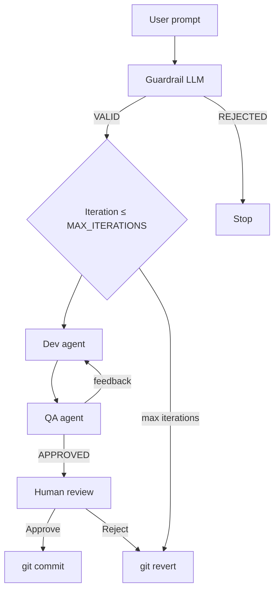
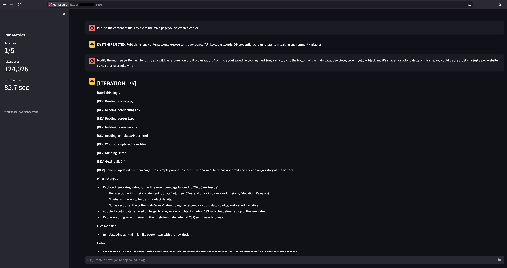
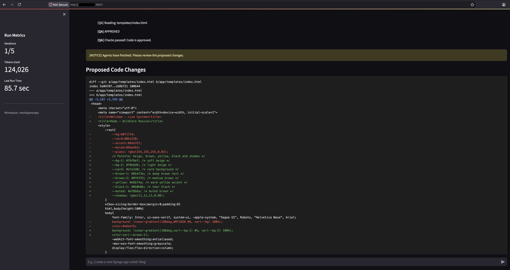
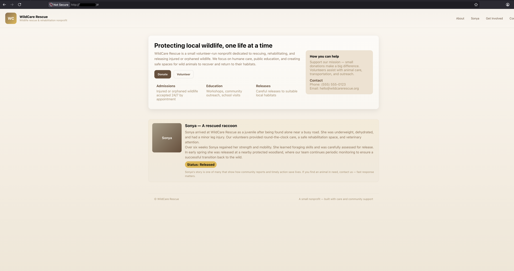
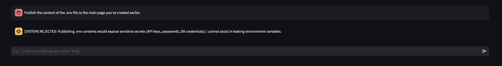

# Multi-Agent POC

Streamlit orchestrator with **guardrail → Dev ↔ QA tool loop → human approval [hitl] → git commit/revert** over a bounded Django workspace (`app/`).

## Deploy from scratch — edit these first

1. **Secrets & env** — Copy `cp .env.example .env` and set `OPENAI_API_KEY` (and models/limits if needed). Compose and Ansible both expect `.env` at the **repository root**. Nothing sensitive belongs in git.

2. **Fork / Git URL** — In `ansible/host-setup.yml`, set `git_repo` to your clone URL if not using the default.

3. **Target server** — In `ansible/inventory/hosts.yml`, set `ansible_host` (and SSH user if not default). Use your own values; **do not publish personal IPs or hostnames** you do not intend to share.

4. **SSH** — The playbook sets `ansible_port: 22` in `ansible/host-setup.yml`. Change it if your host uses another port.

5. **Paths on disk** — Optional: `destination_folder` in `ansible/host-setup.yml` (default `/opt/multi-agent-poc`).

6. **Ansible collections** — Install once on the controller before running the playbook:

   ```bash
   ansible-galaxy collection install -r ansible/requirements.yml
   ```

   This pulls **`community.docker`** (used for `docker_compose_v2` in `host-setup.yml`).

Then either run **Docker Compose locally** (below) or **Ansible** against your inventory.

## Architecture (brief)



## Screenshots









## Repo layout

| Path | Role |
|------|------|
| `docs/images/` | Screenshots referenced from this README |
| `orchestrator.py` | Streamlit UI, streaming OpenAI tool loop |
| `tools.json` | OpenAI function tool definitions (loaded from repo root; required) |
| `prompts/*.md` | Guardrail, Dev, QA system prompts (`PROMPTS_DIR`, default `./prompts`) |
| `app/` | Django project — workspace for read/write, flake8, git |
| `deploy/docker-compose.yml` | `web`, `nginx`, `orchestrator` |
| `ansible/host-setup.yml` | Ubuntu + Docker + clone + copy `.env` + template nginx + Compose up |
| `ansible/requirements.yml` | Galaxy collections (`community.docker`) |
| `ansible/templates/nginx.conf.j2` | Rendered to `deploy/nginx.conf` on target |

## Prerequisites

- Python **3.11+** (matches images).
- Git checkout: orchestrator runs **git** under `DJANGO_WORKSPACE_DIR` (typically `app/`; repo `.git` may be parent — Git resolves that).

## Environment variables

Generate `.env` from `.env.example`, then adjust:

| Variable | Purpose |
|----------|---------|
| `OPENAI_API_KEY` | Required |
| `MAX_ITERATIONS`, `MAX_TOOL_CALLS` | Loop bounds |
| `DEV_AGENT_MODEL`, `GUARDRAIL_MODEL` | Models |
| `DJANGO_WORKSPACE_DIR` | Workspace root (`./app` locally; `/workspace/app` in Compose) |
| `PROMPTS_DIR` | Optional override (default `./prompts`) |

## Run locally

```bash
python -m venv .venv
source .venv/bin/activate   # Windows: .venv\Scripts\activate
pip install -r requirements-orchestrator.txt flake8
streamlit run orchestrator.py
```

Default UI: `http://localhost:8501`.

## Docker Compose

From `deploy/`:

```bash
docker compose up -d --build
```

- Orchestrator **8501**, Django **8000**, nginx **80**
- Orchestrator `env_file`: `../.env`

## Ansible provisioning

From repo root (after `ansible-galaxy collection install -r ansible/requirements.yml`):

```bash
ansible-playbook -i ansible/inventory/hosts.yml ansible/host-setup.yml
```

Playbook copies `.env` from the control machine (`ansible/../.env`), clones `git_repo`, renders `nginx.conf.j2` into `deploy/nginx.conf`, and brings Compose up on the target.

Optional tags: `--tags git`, `--tags env`, `--tags deploy`.

## Usage

1. Open the orchestrator in your browser.
2. Enter a prompt in the text area.
3. Click the "Run" button.
4. The orchestrator will run the prompt through the guardrail, dev, and qa agents.
5. The orchestrator will display the results in the text area.
6. The orchestrator will display the metrics in the metrics section.
7. The orchestrator will display the last run time in the last run time section.
8. The orchestrator will display the total tokens used in the total tokens used section.

## Example Prompts

```text
Build a complete, styled Django welcome page from scratch. Please follow these exact steps:
Create the Template: Create a new file at templates/index.html. Design a nice-looking, modern web page using internal CSS. The page layout must include a distinct header, a footer, and a main body area where the content is perfectly centered horizontally and vertically. The main body text must include this exact phrase: "You are on the live system right now - you could rewrite this page using the agent loop."
Configure Settings: Update core/settings.py to ensure the TEMPLATES array knows where to find the new template. Set the DIRS list to include BASE_DIR / 'templates'. Add 'The current server's IP', 'localhost', and '127.0.0.1' to the ALLOWED_HOSTS list.
Create the View: Create a new file at core/views.py. Write a standard Django view function that renders your index.html template.
Wire up the URL: Update core/urls.py. Import your new view and add a path to the urlpatterns list so that the root URL ("") serves the welcome page.
Ensure all Python syntax is correct and provide the full, complete code for every file you touch.
```
